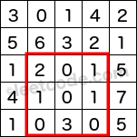

##304. Range Sum Query 2D - Immutable
###题目描述：[https://leetcode.com/problems/range-sum-query-2d-immutable/](https://leetcode.com/problems/range-sum-query-2d-immutable/)
> 给定一个矩阵，求(i1, j1) -> (i2, j2) 的加和。    
> 例如：    
>     
> (2,1) -> (4,3) = 8

###解题思路：
sum[i][j] 的意思是 从左上角到i，j的总和。    
例如 sum[1][1] = 3;
sum[i][j] = sum[i-1][j] + sum[i][j-1] + matrix[i-1][j-1] - sum[i-1][j-1]
###代码：
	class NumMatrix {
	public:
	    int row = 0, col = 0;
	    vector<vector<int> > sum;
	    NumMatrix(vector<vector<int>> &matrix) {
	        row = matrix.size();
	        if(row > 0)
	            col = matrix[0].size();
	        sum = vector<vector<int>>(row+1, vector<int>(col+1, 0));
	        for(int i = 1; i <= row; i++) {
	            for(int j = 1; j <= col; j++) {
	                sum[i][j] = sum[i-1][j] + sum[i][j-1] + matrix[i-1][j-1] - sum[i-1][j-1]; 
	            }
	        }
	    }
	
	    int sumRegion(int row1, int col1, int row2, int col2) {
	        return sum[row2+1][col2+1] - sum[row1][col2+1] - sum[row2+1][col1] + sum[row1][col1]; 
	    }
	};